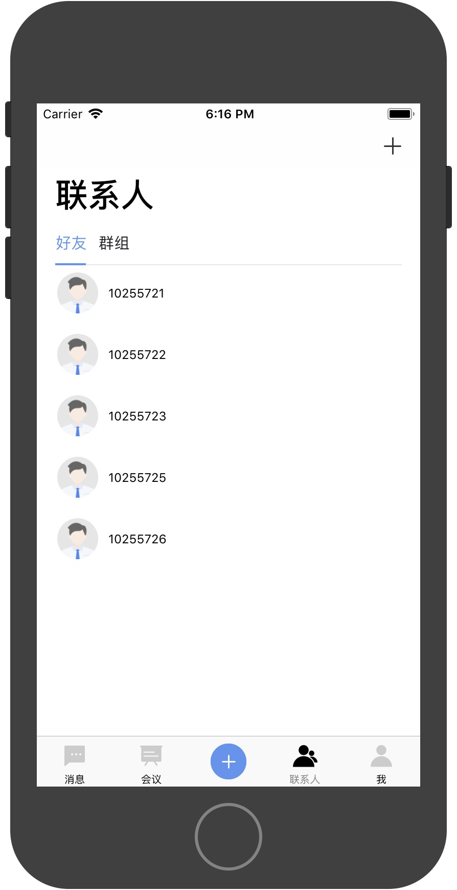
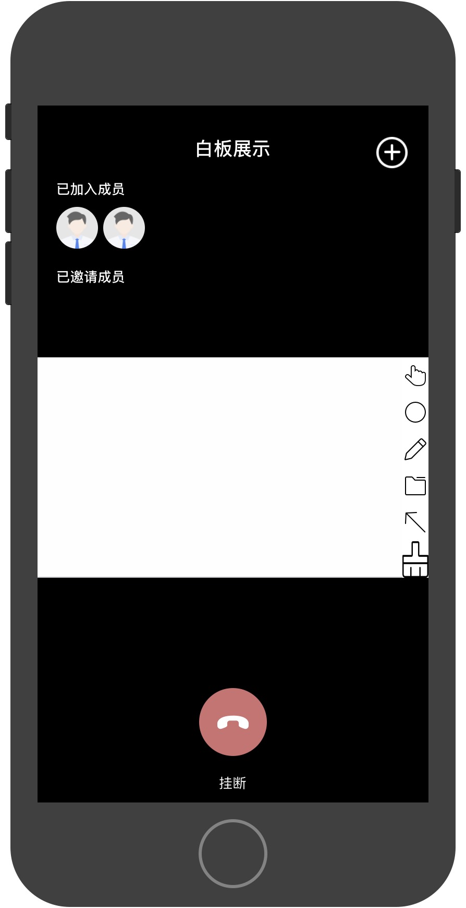

# CubeWare

**CubeWare是[时信魔方平台](https://www.shixincube.com)下CubeEngine(以下简称引擎)的演示demo,旨在通过其演示如何实现引擎强大的IM能力,您可以在CubeWare中找到引擎接口合适的调用方式及IM的简单实现,您也可以通过CubeWare进行二次扩展来快速构建您的IM应用**


**引擎平台满足的功能如下:**

- **基于实时媒体数据路由/混码技术的语音和视频通话**
- **即时消息的发送、接收、回执、撤销、转发** 
- **支持基于邮件的协作和邮件收发管理** 
- **具备会控指令集的在线会议系统** 
- **多媒体音视频通话** 
- **云端文档共享与管理** 
- **静态、实时白板涂鸦与标注** 
- **全平台覆盖，支持Android、iOS、Windows、Mac OS X、Web Browser等**

## 模块简述

CubeWare中将引擎中的包含的功能分为如下几大模块

> 用户服务 **CWAccountService**

> 消息服务 **CWMessageService**

> 文件服务 **CWFileService** 

> 群组服务 **CWGroupService**

> 呼叫服务 **CWCallService**

> 会议服务 **CWConferenceService**

> 白板服务 **CWWhiteBoardService**

> 远程桌面服务 **CWShareDesktopService**

### 用户服务
您可以通过用户服务来获取用户登录引擎的状态、用户信息更新及多端登录及退出用户信息列表等

### 消息服务
您可以通过消息服务来进行消息(包括文件类消息、系统消息、自定义消息等)的发送、撤回、删除等操作

### 文件服务
您可以通过文件服务进行引擎的云端文件处理,包括云端目录及文件的增删改查等操作,另外文件类消息及涉及文件上传的操作都与文件服务有关,会使用到文件服务中的上传及下载功能

### 群组服务
您可以通过群组服务来创建生成或者销毁一个群组,也可以进行群成员管理等操作.群组创建配置中可以设置群组最大人数、群名称、群管理员、群头像等一系列属性,且以依赖群为基础的扩展有群音视频会议及群白板等

### 呼叫服务
您可以通过呼叫服务来进行一对一音视频通话,通过引擎中媒体服务来控制音视频通话中的媒体开关,比如麦克风、扬声器及摄像头的开闭

### 会议服务
您可以通过会议服务进行多人音视频通话管理,会议区分为依赖群组的多人音视频会议及不依赖群组的定时会议(demo中会议部分),不依赖群组的定时会议即位设置了会议开启时间及邀请人员列表,当到达会议开启时间时会根据是否自动通知参会人员设置来通知参会人员加入.

### 白板服务
您可以通过白板服务进行实时的白板演示功能,白板演示工具包含了拖拽、书写、箭头标注、圆形工具、矩形工具、清除白板、设置白板背景色、设置画笔颜色等操作,此服务可以进行一对一白板、群白板、外部创建白板等任何形式的扩展演示

### 远程桌面服务
您可以通过远程桌面服务进行PC到移动终端的桌面共享服务,该服务展示了PC电脑中指定区域的实时演示功能,PC端可以通过此功能向移动端展示其桌面上的操作
 

## 项目截图介绍
#### 消息列表
  

#### 对话详情
   


#### 创建会议
   

#### 会议列表、进入会议
 

#### 联系人列表


#### 群组
 

#### 外部菜单
 

#### 白板演示
  

#### 音视频呼叫
  

## 目录介绍
CubeWare项目目录结构如下图所示,主要包含CubeEngine、CubeWare、CubeEngineDemo三大部分

 

- CubeEngine文件夹下为引擎基础库CubeEngineFoundationKit、引擎音视频媒体通话库CubeEngineCallKit、音视频库WebRTC.framework、引擎底层通讯库Genie.framework及白板资源文件CubeWhiteboardAsset.ast

- CubeWare文件夹下CubeWare为引擎Demo的基础,是管理并分发了引擎中指令的发起及执行回调的枢纽,它连接了引擎中的服务并提供了一系列简易化、可扩展的UI界面,您可以通过继承CubeWare中一些重要的类来扩展实现您的IM应用,外部工程可通过配置列表引入编译得到的静态库CubeWare.a及其头文件CubeWare.h可以获得CubeWare中的所有功能

- CubeEngineDemo文件夹下是Demo工程展示了如何通过引入编译的CubeWare.a及导入其头文件,继承CubeWare中一些重要类以实现的一个IM应用,即为此演示项目


## 接入指南
###  获取AppId和AppKey
要使用引擎，需要先到[魔方官网](http://www.shixincube.com)注册开发者帐号，注册并登录以后，在控制台中选择:我的应用->创建应用，完善app信息后点击确认。创建后app会显示在：我的应用->全部应用 下，选中创建的app,即可查看app的AppId和AppKey。

在CDCubeEngineConfig中设置AppId和AppKey.

### Pod导入引擎依赖库
我们已经将引擎(CubeEngine)的基础库及通话媒体库都制作成pod导入的方式,podfile也已经配置完毕 ,您可以通过终端命令进入到项目pod文件对应目录,通过如下命令来导入引擎依赖库到您的工程中


```
pod install
```

## 更多
如您遇到其它问题请查看[引擎的开发者文档](https://www.shixincube.com/document/ios/introduction.html)或者通过[关于](https://www.shixincube.com/about)联系我们


 


